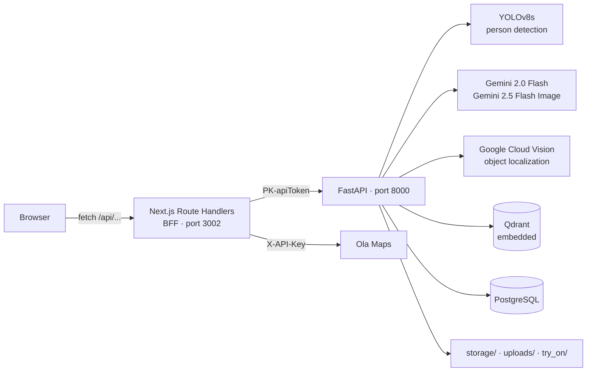

# AI Powered Fashion Discovery

Upload a photo of a person or a garment; the system detects what is being worn, extracts each item's
attributes with a vision LLM, matches those items against a product catalogue using vector search, and
can render the user wearing a selected garment.

| Application | Technology | Location |
| ----------- | ---------- | -------- |
| Backend | Python 3.10/3.11 · FastAPI · SQLAlchemy 2.x · PostgreSQL · Qdrant | [`backend/`](backend/) |
| Frontend | Next.js 16 (App Router) · React 19 · TypeScript · Tailwind v4 | [`frontend/`](frontend/) |

---

## Table of contents

- [Architecture](#architecture)
- [AI pipeline](#ai-pipeline)
- [Features](#features)
- [Prerequisites](#prerequisites)
- [Quick start](#quick-start)
- [Environment variables](#environment-variables)
- [Running locally](#running-locally)
- [API overview](#api-overview)
- [Testing](#testing)
- [Build and deployment](#build-and-deployment)
- [Documentation](#documentation)
- [Known limitations](#known-limitations)
- [Troubleshooting](#troubleshooting)

---

## Architecture

The browser never calls FastAPI directly. Pages call same-origin Next.js Route Handlers, which attach
the shared `PK-apiToken` server-side and forward to the backend.



Because all browser traffic is same-origin, the backend has **no CORS middleware and needs none**.

Detail: [System overview](docs/architecture/system-overview.md) ·
[Backend](docs/architecture/backend-architecture.md) ·
[Frontend](docs/architecture/frontend-architecture.md) ·
[Data flow](docs/architecture/data-flow.md)

---

## AI pipeline

```
image bytes
   ↓ decode + resize (max side 1024, aspect preserved)
   ↓ YOLOv8s detect  ──► person found? ──► person mode : object mode
   ↓ Gemini 2.0 Flash  (PERSON_PROMPT / OBJECT_PROMPT) → attributes + bbox_relative
   ↓ Google Cloud Vision object_localization → normalised bboxes
   ↓ choose_best_bbox: Vision "precise" > Gemini "approximate" > none
   ↓ SentenceTransformer all-mpnet-base-v2 (768-d) → Qdrant filtered search, top-3
   ↓ enriched items with product_list
```

Virtual try-on is a separate path: face-presence gate → NSFW gate → **Gemini 2.5 Flash Image**.

Detail: [image-analysis-pipeline.md](docs/ai/image-analysis-pipeline.md) ·
[vector-search.md](docs/ai/vector-search.md) ·
[virtual-try-on.md](docs/ai/virtual-try-on.md) ·
[prompts-and-schemas.md](docs/ai/prompts-and-schemas.md)

> The technology list in [`backend/readme`](backend/readme) is inaccurate — it names CLIP, Celery and
> Redis, none of which exist in this codebase. The stack above is what the code actually does.
> See [AUDIT.md](AUDIT.md) issue 6.

---

## Features

| Feature | Status | Documentation |
| ------- | ------ | ------------- |
| Image search — detect, describe and match products | ✅ Complete | [image-search.md](docs/features/image-search.md) |
| Virtual try-on | ✅ Complete | [virtual-try-on.md](docs/features/virtual-try-on.md) |
| Product catalogue (with vector sync) | ✅ Complete | [product-catalogue.md](docs/features/product-catalogue.md) |
| Image gallery | ✅ Complete | [gallery.md](docs/features/gallery.md) |
| Masters — category, sub-category, colour, brand | ✅ Complete | [masters.md](docs/features/masters.md) |
| Stores | ✅ Complete | [stores.md](docs/features/stores.md) |
| Search history | ✅ Complete | [search-history.md](docs/features/search-history.md) |
| Nearby stores (Ola Maps) | ✅ Complete | [nearby-stores.md](docs/features/nearby-stores.md) |
| **Phase 2 — models / looks** | ⚠️ **In development** | [phase2-models.md](docs/features/phase2-models.md) |
| **Phase 3 — cosmetics / beauty** | ⚠️ **Frontend only — backend not implemented** | [phase3-cosmetics.md](docs/features/phase3-cosmetics.md) |

---

## Prerequisites

| Requirement | Version | Notes |
| ----------- | ------- | ----- |
| Python | **3.10 or 3.11** | Stated in `backend/readme` |
| PostgreSQL | 12+ | Must be running before the backend starts |
| Node.js | v24.12.0 | Linked from `frontend/README.md` |
| npm | bundled | Only `package-lock.json` is present |
| Google Gemini API key | — | **Required** — backend will not start without it |
| Google Cloud Vision service-account key | — | **Required** — see [google-cloud-credentials.md](docs/setup/google-cloud-credentials.md) |

Full detail: [prerequisites.md](docs/setup/prerequisites.md)

---

## Quick start

```bash
# 1. Database
createdb fashion_discovery      # name must match DB_NAME

# 2. Backend
cd backend
python -m venv venv
.\venv\Scripts\activate                    # Windows;  source venv/bin/activate elsewhere
python -m pip install --upgrade pip
pip install torch==2.9.1 torchaudio==2.9.1 --index-url https://download.pytorch.org/whl/cpu

# requirements.txt is UTF-16 — convert before installing (see note below)
iconv -f UTF-16 -t UTF-8 requirements.txt > requirements.utf8.txt   # PowerShell alternative in docs
pip install -r requirements.utf8.txt
pip install python-docx pymupdf langchain-chroma langchain-core langchain-google-genai \
            pymysql rapidfuzz google-genai        # imported but undeclared

# create backend/.env  and  backend/vision-key.json  (see below)
uvicorn app.main:app --reload --host 0.0.0.0 --port 8000

# 3. Frontend (new terminal)
cd frontend
npm i
# create frontend/.env.local
npm run dev
```

Open <http://localhost:3002>. The root path redirects to `/home`.

> **Two install caveats, both verified.** `requirements.txt` is saved as UTF-16 and pip cannot parse it;
> and eight imported packages are missing from it. Exact workarounds and the full package list are in
> [backend-setup.md](docs/setup/backend-setup.md). [AUDIT.md](AUDIT.md) issues 4 and 5.

---

## Environment variables

Neither env file is committed. Create both by hand.

### `backend/.env`

| Variable | Purpose | Example |
| -------- | ------- | ------- |
| `DB_HOST` / `DB_PORT` / `DB_NAME` / `DB_USERNAME` / `DB_PASSWORD` | PostgreSQL connection | `localhost` / `5432` / `fashion_discovery` / `postgres` / `<secret>` |
| `API_TOKEN` | Shared token checked as `PK-apiToken` | `<secret>` |
| `TOKEN_SECRET` | Seed for the Fernet key in `app/utils/crypto.py` | `<secret>` |
| `GOOGLE_API_KEY` | Gemini API key | `<secret>` |
| `STORAGE_DIR` | Root for uploaded images and search JSON | `storage` |
| `VECTOR_DB_DIR` | Qdrant embedded storage path | `qdrant_storage` |
| `BASE_URL` | Public base URL used to build returned image URLs | `http://127.0.0.1:8000/` |

Plus `backend/vision-key.json` — **not** an environment variable but required.
See [google-cloud-credentials.md](docs/setup/google-cloud-credentials.md).

### `frontend/.env.local`

| Variable | Purpose |
| -------- | ------- |
| `NEXT_PUBLIC_API_URL` | Backend base URL — **must end with `/`** |
| `API_TOKEN` | Must match the backend value. Server-only — do not add `NEXT_PUBLIC_` |
| `NEXT_PUBLIC_OLA_MAPS_API_KEY` | Ola Maps nearby-search and reverse geocoding |
| `NEXT_PUBLIC_GOOGLE_MAPS_API_KEY` | Google Maps JS on the upload page |

Complete inventory, including variables present but never read:
[environment-variables.md](docs/setup/environment-variables.md)

---

## Running locally

```
PostgreSQL (5432)  →  Backend (8000)  →  Frontend (3002)
```

| Component | Technology | Port | Command | Depends on |
| --------- | ---------- | ---: | ------- | ---------- |
| Database | PostgreSQL | 5432 | external service | — |
| Backend | FastAPI / uvicorn | 8000 | `uvicorn app.main:app --reload --host 0.0.0.0 --port 8000` | PostgreSQL, Gemini key, `vision-key.json` |
| Qdrant | embedded | — | starts in-process | Backend |
| Frontend | Next.js | 3002 | `npm run dev` | Backend |

There is **no Redis, no Celery, no broker and no worker process**.

Verify:

- `GET http://localhost:8000/` → `{"message": "FastAPI MVC Running"}`
- Swagger → <http://localhost:8000/docs>
- Startup console prints `✅ Database connected successfully!`
- Frontend → <http://localhost:3002>

Detail: [local-development.md](docs/setup/local-development.md)

---

## API overview

All endpoints require `PK-apiToken`, **except `/models/*`** — see
[Known limitations](#known-limitations). Every response uses a fixed envelope returned with **HTTP 200**,
including errors:

```json
{ "Success": { "message": "...", "data": {} }, "Code": 0,    "Error": null }
{ "Success": null,                             "Code": 4000, "Error": { "message": "..." } }
```

| Group | Prefix | Endpoints | Reference |
| ----- | ------ | --------: | --------- |
| Products | `/product` | 7 | [products-and-gallery.md](docs/api/products-and-gallery.md) |
| Gallery | `/gallery` | 2 | [products-and-gallery.md](docs/api/products-and-gallery.md) |
| Masters | `/master` | 17 | [masters.md](docs/api/masters.md) |
| Stores | `/store` | 4 | [stores.md](docs/api/stores.md) |
| Try-on | `/photo` | 1 | [photo-try-on.md](docs/api/photo-try-on.md) |
| Phase 2 models | `/models`, `/model` | 13 | [models-phase2.md](docs/api/models-phase2.md) |

**45 live endpoints.** Conventions: [overview.md](docs/api/overview.md) ·
Codes: [error-codes.md](docs/api/error-codes.md)

---

## Testing

**This repository contains no automated tests** — no pytest, Jest, Vitest or Playwright configuration,
no `test` script, no CI pipeline, no coverage config. `npm run lint` is the only quality gate.

See [testing-status.md](docs/testing/testing-status.md).

---

## Build and deployment

| Task | Command | Directory |
| ---- | ------- | --------- |
| Backend production server | `uvicorn app.main:app --host 0.0.0.0 --port 8000` | `backend` |
| Frontend production build | `npm run build` | `frontend` |
| Frontend production server | `npm run start` | `frontend` |
| Frontend lint | `npm run lint` | `frontend` |

There is **no Dockerfile, docker-compose, Makefile or CI/CD configuration**, and no database migration
tooling. Backend lint/format/type-check are not configured.

---

## Documentation

| Area | Entry point |
| ---- | ----------- |
| Index | [docs/README.md](docs/README.md) |
| Architecture | [docs/architecture/](docs/architecture/) |
| AI pipeline | [docs/ai/](docs/ai/) |
| Setup | [docs/setup/](docs/setup/) |
| API reference | [docs/api/](docs/api/) |
| Database schema | [docs/database/schema.md](docs/database/schema.md) |
| Features | [docs/features/](docs/features/) |
| Integrations | [docs/integrations/](docs/integrations/) |
| Security | [docs/security/authentication-and-authorization.md](docs/security/authentication-and-authorization.md) |
| Testing | [docs/testing/testing-status.md](docs/testing/testing-status.md) |
| Troubleshooting | [docs/troubleshooting/common-issues.md](docs/troubleshooting/common-issues.md) |
| **Code audit — 24 confirmed issues** | [AUDIT.md](AUDIT.md) |

---

## Known limitations

- **`/models/*` endpoints are unauthenticated.** The auth middleware skips any path beginning `/models`
  so that the `/models` static mount can serve files — but that also matches the `/models` **router**,
  leaving all 10 Phase 2 endpoints reachable with no token. [AUDIT.md](AUDIT.md) issue 1.
- **Product vectors are wiped on every backend start.** `init_collection("products")` runs at import and
  calls `recreate_collection`, which drops and recreates the collection. Re-index after each restart.
  [AUDIT.md](AUDIT.md) issue 3.
- **Uploaded photos and try-on output are served without authentication** via the `/storage`,
  `/uploads`, `/try_on` and `/debug` mounts.
- **Phase 3 has no backend.** Eight frontend routes call `cosmetics/*`; no such router exists.
- **Phase 2 is incomplete** — 4 endpoints the frontend calls do not exist yet; 5 backend endpoints are
  not yet called.
- **No database migrations.** `create_all()` creates missing tables but never alters existing ones.
- **Errors return HTTP 200** — clients must inspect `Code`.
- 24 confirmed issues are catalogued with evidence in [AUDIT.md](AUDIT.md).

---

## Troubleshooting

Dependency install failures, missing credentials, database connection errors, port conflicts, empty
search results and try-on failures are covered in
[common-issues.md](docs/troubleshooting/common-issues.md).
