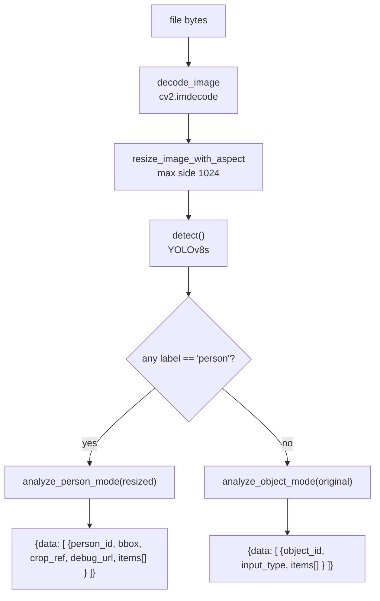

# AI — Image Analysis Pipeline

The core of the product: turning a photograph into a structured list of fashion items with attributes
and bounding boxes.

**Implementation:** [`app/services/decision_engine.py`](../../backend/app/services/decision_engine.py)
(411 lines), [`detector.py`](../../backend/app/services/detector.py),
[`vision_service.py`](../../backend/app/services/vision_service.py).

**Entry point:** `analyze_image(file_bytes)` — called by `POST /product/search` and `POST /product/analyze`.

## Model stack

| Stage | Model / service | Where it runs |
| ----- | --------------- | ------------- |
| Person/object detection | **YOLOv8s** (`ultralytics`, weights `yolov8s.pt`) | local |
| Attribute extraction | **Gemini 2.0 Flash** | Google API |
| Object localization | **Google Cloud Vision** `object_localization` | Google API |
| Arbitration | rule-based `choose_best_bbox` | local |

> The `backend/readme` claims CLIP embeddings. **No CLIP model exists in this codebase.** Image
> understanding is done by Gemini and Cloud Vision; the only embedding model is a *text* encoder used
> later for product matching ([vector-search.md](vector-search.md)).

## Pipeline



### Pre-processing

```python
def resize_image_with_aspect(image, max_side=1024):
    h, w = image.shape[:2]
    if max(h, w) <= max_side:
        return image, 1.0
    scale = max_side / max(h, w)
    return cv2.resize(image, (int(w*scale), int(h*scale)), cv2.INTER_AREA), scale
```

`decode_image` raises `ValueError` on empty bytes or a failed decode — an invalid upload surfaces as a
500 through the exception middleware rather than a clean validation error.

> **Coordinate-space asymmetry.** `analyze_person_mode` is passed the **resized** image while
> `analyze_object_mode` is passed the **original**. Boxes from the two branches are therefore in
> different pixel spaces, and the returned `scale` factor is discarded (`resized, _ = ...`). A consumer
> cannot map object-mode boxes back onto a resized rendering without recomputing the ratio.

### Person mode

```python
persons.sort(key=lambda d: area(d["bbox"]), reverse=True)
for idx, det in enumerate(persons[:1]):          # ← only the largest person
```

Only **one** person is analysed per image regardless of how many YOLO finds.

For that person: crop with `pad=2`, write the crop to `/tmp/person_crops/person_1.jpg`, then run Gemini
and Cloud Vision **on the crop** (not the full frame), which keeps the model focused and makes returned
coordinates relative to the crop.

Gemini returns `{"wearing": [...], "carrying": [...]}`; both lists are walked and each object passed
through `choose_best_bbox` with its `relation` recorded.

### Object mode

Used when no person is detected. Gemini is asked with `OBJECT_PROMPT`, Cloud Vision provides a box, and
if no valid box results the code falls back to a fixed centre rectangle:

```python
bbox = {"x1": int(w*0.25), "y1": int(h*0.25), "x2": int(w*0.75), "y2": int(h*0.75)}
```

Gemini's response is normalised to a list, and non-dict entries are skipped with a warning.

## Bounding-box arbitration

Two independent sources produce candidates. `choose_best_bbox` resolves them.

**1. Vision candidates** — matched to the Gemini item by label:

```python
SYNONYMS = {
  "blazer":        {"blazer", "jacket", "coat"},
  "top":           {"top", "shirt", "t-shirt", "tee", "blouse"},
  "denim shorts":  {"shorts", "denim shorts", "jean shorts"},
  "earring":       {"earring", "earrings", "jewelry"},
  "ring":          {"ring", "jewelry"},
  "cell phone":    {"cell phone", "phone", "mobile", "smartphone"},
  "makeup":        {"lipstick, eyeliner, eyeshadow"},
}
```

`label_match` checks the synonym sets, then falls back to substring containment in either direction.

> The `"makeup"` entry contains **one** string with embedded commas rather than three separate members,
> so it can never match a single-word label. Verified from the literal.

**2. Gemini candidate** — `bbox_relative` as `[ymin, xmin, ymax, xmax]` on a 0–1000 scale, converted to
crop-relative pixels and clamped to the image.

**Precedence:**

| Outcome | `confidence` |
| ------- | ------------ |
| A matching Vision box exists | `"precise"` |
| Otherwise, a valid Gemini box exists | `"approximate"` |
| Neither | `"none"` and `bbox: null` |

### Small-item policy

Earrings and rings get an extra gate:

```python
SMALL_ITEM_TYPES = {"earring", "earrings", "ring", "finger ring"}
SMALL_ITEM_MAX_REL_AREA = 0.02      # 2% of the person bbox
SMALL_ITEM_MIN_REL_AREA = 0.0001    # 0.01%
```

`small_item_valid` requires the box to fall inside that relative-area band **and** to sit near an
anatomical landmark (ear points for earrings, finger points for rings).

> `choose_best_bbox` is always called **without** a `landmarks` argument, and `small_item_valid` returns
> `False` when `landmarks is None` — the code comments this as "be conservative". The practical result is
> that **earrings and rings always end with `bbox: null`**. Their attributes still reach product matching;
> only the box is dropped. No landmark detector is wired into the pipeline.

## Output shape

Person mode:

```json
{
  "data": [{
    "person_id": "person_1",
    "input_type": "person",
    "bbox": { "x1": 120, "y1": 40, "x2": 480, "y2": 900 },
    "crop_ref": "/crops/person_1.jpg",
    "debug_url": "http://127.0.0.1:8000/debug/<uuid>.jpg",
    "items": [{
      "category": "clothing", "type": "t-shirt", "subtype": null,
      "color": "black", "shade": null, "brand": null,
      "gender": "male", "pattern": "solid",
      "bbox": { "x1": 150, "y1": 200, "x2": 420, "y2": 520 },
      "relation": "wearing",
      "confidence": "precise"
    }]
  }]
}
```

`ProductController.search` then adds a `product_list` array to each item — see
[vector-search.md](vector-search.md).

## Debug artefacts

`draw_debug` renders the person box in green and each item box in red with its type label, writing to
`/tmp/debug_boxes/{uuid}.jpg` and returning a URL built from `BASE_URL`. Served at `/debug`, **without
authentication**.

Nothing prunes these directories, and the paths are POSIX-style — on Windows they resolve to the current
drive root. [AUDIT.md](../../AUDIT.md) issues 18 and 22.

## Error handling

| Failure | Behaviour |
| ------- | --------- |
| Empty or undecodable bytes | `ValueError` → 500 |
| Cloud Vision raises | Caught by a bare `except`, `vision_items = []` — the pipeline silently degrades to Gemini-only |
| Gemini returns non-JSON | `clean_json` extracts the first `{...}`/`[...]`; on failure `describe` returns `{}` and the item list is empty |
| Gemini quota/network failure | Propagates → 500 |
| Unsafe image | Rejected earlier by `gemini_is_safe_tryon` in the controller → `Code 4002` |

There is **no timeout and no retry** on either Google call.

## Performance

Each analysed image costs, at minimum: one local YOLO inference, one Gemini vision call, and one Cloud
Vision call — plus one embedding encode and one Qdrant query **per unique detected item**. The Gemini
call is wrapped in `run_in_executor` so it does not block the event loop; the rest is synchronous.

## Related

- [prompts-and-schemas.md](prompts-and-schemas.md) — the exact prompt contracts
- [vector-search.md](vector-search.md) — what happens to the extracted attributes
- [../features/image-search.md](../features/image-search.md) — the user-facing feature
- [../api/products-and-gallery.md](../api/products-and-gallery.md) — `POST /product/search`
