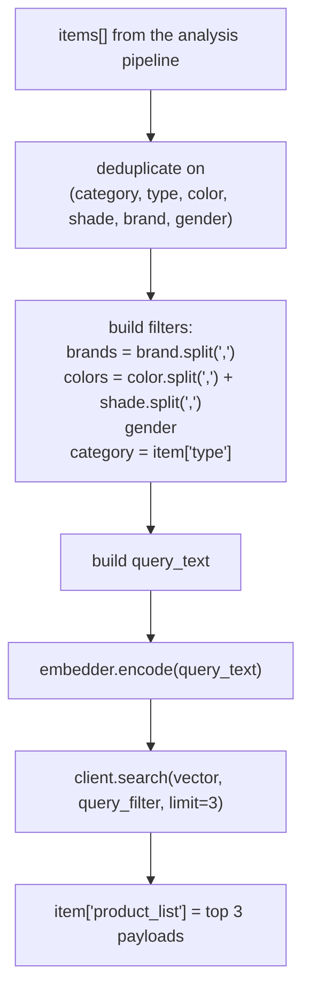

# AI — Vector Search

How extracted item attributes become product recommendations.

**Implementation:** [`app/vector/vector_db.py`](../../backend/app/vector/vector_db.py) (Qdrant client and
search), [`app/services/product_service.py`](../../backend/app/services/product_service.py)
(`search_products_for_items`, `_master_response`).

## Configuration

| Component | Value |
| --------- | ----- |
| Vector database | **Qdrant**, embedded mode (`QdrantClient(path=VECTOR_DB_DIR)`) |
| Collection | `products` |
| Embedding model | **`sentence-transformers/all-mpnet-base-v2`** |
| Vector size | **768** |
| Distance | **COSINE** |
| Results per item | `limit=3` |

Embedded mode means Qdrant runs **in-process** against a local directory — there is no Qdrant server to
start. `VECTOR_DB_DIR` defaults to the `qdrant_storage/` folder in `backend/`.

> `all-mpnet-base-v2` is a **text** embedding model. Images are never embedded. All similarity is
> computed between a *textual description* of the query item and a *textual description* of each
> product. The `backend/readme`'s claim of CLIP image embeddings is not implemented.

## Indexing — writing products

Triggered from `_master_response(db, obj, saveVector=True)` whenever a product is created or updated.

```python
product["gender"]        = product["gender"].lower()
product["category_name"] = product["category"]["name"].lower()
product["brand_names"]   = [b["name"].lower() for b in product["brands"]]
product["color_names"]   = [c["name"].lower() for c in product["colors"]]

text = (f"product name: {product['name']} / "
        f"gender: {product['gender']} / "
        f"category: {product['category']['name']} / "
        f"brands: {', '.join(...)} / "
        f"colors: {', '.join(...)} / "
        f"intro: {product['product_intro']} / "
        f"description: {product['description']} / "
        f"specification: {product['specification']}")

vector = embedder.encode(text).tolist()
client.upsert(collection_name, points=[PointStruct(id=product["id"], vector=vector, payload=product)])
```

Two design points worth knowing:

- **The point ID is the PostgreSQL product ID**, so upsert is idempotent and update-in-place works.
- **The payload is the entire product dict**, including the lower-cased `brand_names`, `color_names`,
  `category_name` and `gender` used as filter keys. Search results therefore carry full product data
  without a second database query.

## Querying — matching detected items

[`ProductService.search_products_for_items`](../../backend/app/services/product_service.py):



### The query text

```python
query_text = (f"product name: {gender} {category} {' '.join(brands)} {' '.join(colors)} / "
              f"gender: {gender} / "
              f"category: {category} / "
              f"brands: {', '.join(brands)} / "
              f"colors: {', '.join(colors)} / ")
```

Deliberately mirrors the *prefix* of the indexing text so the two embeddings live in a similar region of
the space — but it stops after `colors:`, while indexed products continue with `intro`, `description` and
`specification`. Products with long descriptions are therefore embedded further from any query.

### Two subtleties in filter construction

**Category comes from `type`, not `category`:**

```python
# category = item.get("category", "").lower()      ← commented out
category = item.get("type", "").lower()
```

The Gemini `category` field is a coarse bucket (`clothing`, `accessory`, `footwear`, `jewelry`) while
`type` is the specific item (`t-shirt`, `jeans`). Matching on `type` against `category_name` only works
if your master categories are named for specific garment types.

**Colour and shade are merged:**

```python
color_part = [...item["color"].split(",")]
shade_part = [...item["shade"].split(",")]
colors = color_part + shade_part
```

### Filtering

```python
conditions = []
if brands:     conditions.append(FieldCondition(key="brand_names",   match=MatchAny(any=brands)))
if colors:     conditions.append(FieldCondition(key="color_names",   match=MatchAny(any=colors)))
if gender:     conditions.append(FieldCondition(key="gender",        match=MatchValue(value=gender)))
if categories: conditions.append(FieldCondition(key="category_name", match=MatchValue(value=categories)))

query_filter = Filter(must=conditions) if conditions else None
```

> **All conditions are `must` — a logical AND.** Brand and colour use `MatchAny` (any of the listed
> values), but gender and category require an exact match. If Gemini reports a brand your catalogue does
> not stock, or a colour name that does not exist as a master colour, the query returns **zero** results
> rather than degraded ones. There is no fallback to an unfiltered search.
>
> This is the most common cause of "search found nothing" when the index is populated.

### Result shape

```json
"product_list": [{
  "id": 12, "hsn_code": "…", "product_code": "…", "name": "…",
  "mrp": 1599.0, "price": 1299.0, "gender": "male",
  "category": { "id": 2, "name": "T-Shirt" },
  "brands": ["puma"], "colors": ["black", "red"]
}]
```

Fields are read straight from the Qdrant payload — a `KeyError` on any missing key surfaces as a 500, so
products indexed before a payload change can break search until re-saved.

## ⚠️ The collection is destroyed on every start

```python
def init_collection(collection_name="products", vector_size=768):
    client.recreate_collection(...)

init_collection("products")     # module scope — runs on every import
```

`recreate_collection` **deletes** an existing collection and creates an empty one. Because the call sits
at module scope, it runs on every application start and every `--reload` cycle.

**Consequences:**

- The product index is empty after every restart.
- Image search returns no products until every product is re-saved.
- The failure is silent — the following `client.count(...)` simply prints `Total points: 0`.

**Workaround until fixed:** re-save products after each backend start (`POST /product/save` for each), or
comment out the module-scope `init_collection("products")` call once the collection exists.

[AUDIT.md](../../AUDIT.md) issue 3.

## Other operations

| Function | Status |
| -------- | ------ |
| `save_vector` / `update_vector` | Used on product create/update |
| `search_vector` | Unfiltered search — defined, not used by the live flow |
| `filter_search_vector` | **The live search path** |
| `delete_vector` | Defined, but the call in `ProductService.delete` is **commented out** — deleted products stay searchable ([AUDIT.md](../../AUDIT.md) issue 20) |

## A second, unrelated vector store

[`app/services/vector_db.py`](../../backend/app/services/vector_db.py) configures a **Chroma** store
(collection `pdf_chunks`, `GoogleGenerativeAIEmbeddings` `models/embedding-001`, persisted to
`./chroma_store`) for document chunks. It is unrelated to fashion discovery and is not reached by any
registered route. Do not confuse the two modules — the fashion path is `app/vector/vector_db.py`.

## Known limitations

1. **Index wiped on every restart** — the dominant operational issue.
2. **AND-only filtering** returns nothing rather than approximate matches.
3. **No score threshold** — the top 3 are returned however poor the similarity.
4. **Query and document texts are asymmetric**, biasing against richly-described products.
5. **`type` vs `category` mismatch** requires master categories named for garment types.
6. **Deleted products remain searchable.**
7. **No re-index command** — there is no endpoint or script to rebuild the collection from PostgreSQL.
8. **Embedding model loads at import**, adding startup time and memory on every reload.
