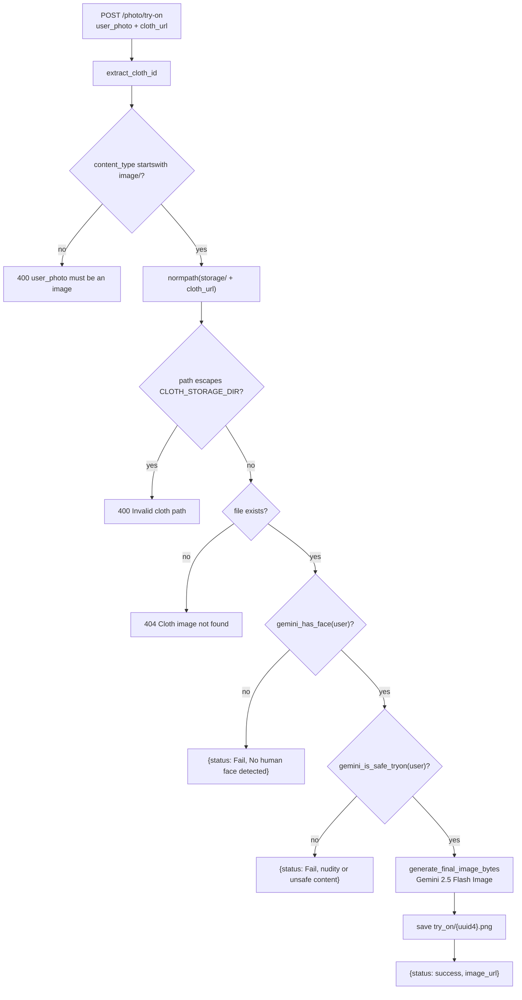

# AI — Virtual Try-On

Generates a photorealistic image of the user wearing a selected garment.

**Implementation:** [`app/services/photo_service.py`](../../backend/app/services/photo_service.py),
[`app/routes/photo_route.py`](../../backend/app/routes/photo_route.py).
**Endpoint:** `POST /photo/try-on`.

## Model

| Property | Value |
| -------- | ----- |
| Model | **`gemini-2.5-flash-image`** |
| SDK | `google.genai` (new SDK) — `client.models.generate_content` |
| Config | `GenerateContentConfig(response_modalities=["IMAGE"])` |
| Auth | `GOOGLE_API_KEY`, read via `os.getenv` after `load_dotenv()` |

`photo_service` initialises its own client at import and raises `RuntimeError("GOOGLE_API_KEY not
found")` if the key is absent — so a missing key prevents the backend from starting.

> Note this module uses `os.getenv` + `load_dotenv()` directly rather than the project's `app.config.env`
> helper used everywhere else.

## Flow



## Input handling

`cloth_url` accepts either a full URL or a bare storage-relative path:

```python
def extract_cloth_id(value: str) -> str:
    if value.startswith("http"):
        if "/storage/" not in value:
            raise HTTPException(400, "Invalid cloth image URL")
        return value.split("/storage/", 1)[-1]
    return value
```

### Path-traversal guard — correctly implemented

```python
cloth_path = os.path.normpath(os.path.join(CLOTH_STORAGE_DIR, cloth_url))
if not cloth_path.startswith(CLOTH_STORAGE_DIR):
    raise HTTPException(400, "Invalid cloth path")
```

`normpath` collapses `..` segments before the prefix check, so `../../etc/passwd` is rejected. This is
one of the better-implemented parts of the codebase.

`CLOTH_STORAGE_DIR` and `TRY_ON_DIR` are derived from `os.getcwd()`, so the backend **must** be started
from `backend/`.

## Safety gates

Two Gemini calls run before generation, both on the user's photo:

| Gate | Failure response |
| ---- | ---------------- |
| `gemini_has_face(user_bytes)` | `{"status": "Fail", "message": "No human face detected"}` |
| `gemini_is_safe_tryon(user_bytes)` | `{"status": "Fail", "message": "Invalid image: nudity or unsafe content detected"}` |

Both return **HTTP 200** with `status: "Fail"` — they do not use the `{Success, Code, Error}` envelope
and do not raise. Clients must check `status`.

`gemini_is_safe_tryon` is reused by `ProductController.search` to gate image search, where a failure
becomes `Code 4002`.

## The generation prompt

Sent as a three-part `contents` array — identity instruction, user image, then the task instruction
followed by the garment image:

```
TASK: Use the following person as the identity reference.
<user image>
You are an image editing and virtual try-on system. Input includes one base image of a person and one
reference image containing exactly one clothing item (shirt OR t-shirt OR pants OR jeans OR sunglasses
ONLY). Your task is to apply ONLY the selected clothing item from the reference image onto the person in
the base image.
STRICT RULES: Replace ONLY the provided clothing category and nothing else. Do NOT modify, add, remove,
or hallucinate any other clothing or accessories. If a shirt or t-shirt is selected, completely remove
the existing upper-body clothing first, then apply the new item. If pants or jeans are selected,
completely remove the existing lower-body clothing first, then apply the new item. If sunglasses are
selected, replace ONLY the eyewear. Preserve the person's face, body shape, pose, skin tone, hair,
lighting, and background EXACTLY as in the base image. Use photorealistic rendering with correct fabric
folds, shadows, and perspective. Use ONLY ONE reference image per generation. Do NOT mix garments. Do
NOT generate or substitute any random clothing. Output a single realistic image where the person is
wearing ONLY the selected clothing item from the reference image, correctly aligned and naturally
fitted.
<garment image>
```

> **The prompt restricts the garment to shirt, t-shirt, pants, jeans or sunglasses.** Nothing validates
> this server-side — any image in `storage/` can be passed as `cloth_url`, and the model's behaviour with
> an out-of-scope garment (a dress, shoes, a bag) is undefined.

Both images are declared `image/jpeg` via `Part.from_bytes(mime_type="image/jpeg")` regardless of their
actual format. PNG and WebP files exist in `storage/`, so the declared MIME type is sometimes wrong.

## Output

```python
for part in response.candidates[0].content.parts:
    if part.inline_data:
        Image.open(io.BytesIO(part.inline_data.data)).save(output_path)
        return
raise RuntimeError("Gemini did not return an image")
```

Saved as `try_on/{uuid4}.png`; the response returns `f"{env('BASE_URL')}try_on/{output_name}"`.

`BASE_URL` must end with a slash or the URL is malformed.

```json
{ "status": "success", "image_url": "http://127.0.0.1:8000/try_on/588c77cb-….png" }
```

## Storage and exposure

Generated images accumulate in `try_on/` and are served by
`app.mount("/try_on", StaticFiles(directory="try_on"))` — **exempt from token verification** in the auth
middleware. Anyone who can reach the backend and knows or guesses a filename can retrieve any generated
image. Filenames are UUID4, which is the only protection.

Nothing prunes the directory. [AUDIT.md](../../AUDIT.md) issue 9.

## Error handling

| Situation | Result |
| --------- | ------ |
| Non-image `user_photo` | `HTTPException 400` |
| URL without `/storage/` | `HTTPException 400` |
| Path escapes storage | `HTTPException 400` |
| Garment file missing | `HTTPException 404` (message includes the resolved server path) |
| Empty user image | `HTTPException 400` |
| No face / unsafe | HTTP 200 with `status: "Fail"` |
| Gemini returns no image part | `RuntimeError` → 500 |
| Gemini network/quota failure | Propagates → 500 |

There is **no timeout and no retry**. Image generation is slow, so the request can be long-running;
nothing streams progress.

> The 404 message embeds the absolute server path (`f"Cloth image not found: {cloth_path}"`), disclosing
> filesystem layout to the caller.

## Dead code in the same module

`generate_final_image(user_photo_path, clothing_items_paths)` is a second, older implementation that
calls `_image_part` with **paths** where the function expects `(bytes, mime)`. It would raise if invoked.
Nothing calls it.

## Related

- [../features/virtual-try-on.md](../features/virtual-try-on.md) — user-facing feature
- [../api/photo-try-on.md](../api/photo-try-on.md) — endpoint reference
- [../integrations/google-gemini.md](../integrations/google-gemini.md) — models, cost, failure modes
