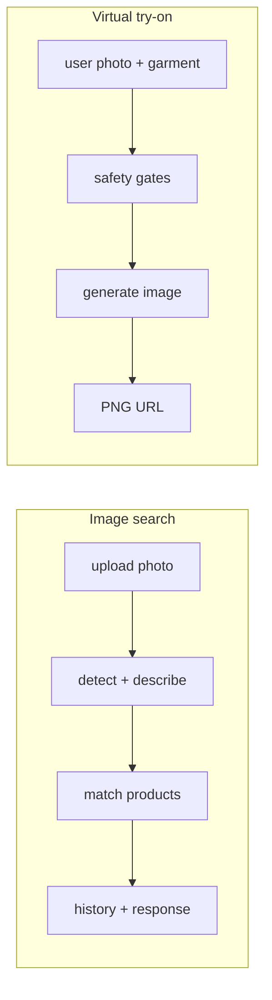
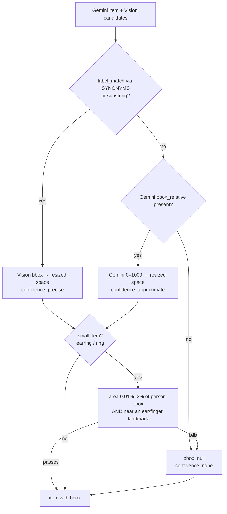
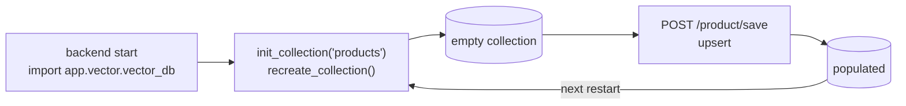

# Data Flow

End-to-end journeys through the system, traced to source.

## The two primary flows



---

## Flow 1 — Image search

**Trigger:** the user uploads a photograph on `/uploade`.

```
Browser
  → POST /api/search                      (multipart)
  → POST /product/search
  → ProductController.search
      contents = await file.read()
      gemini_is_safe_tryon(contents)      NSFW gate → Code 4002 if unsafe
      data = await analyze_image(contents)
      for each detected group:
          items = ProductService.search_products_for_items(items)
      save_local_file2(admin_id, filename, contents)
      ProductService.save_history(db, image_path, enriched_data, admin_id)
  → success_response("Files uploaded successfully", enriched_data)
```

### Stage 1 — Detection and branch

[`decision_engine.analyze_image`](../../backend/app/services/decision_engine.py):

```python
orig_image = decode_image(file)                       # cv2.imdecode, raises on invalid bytes
resized, _ = resize_image_with_aspect(orig_image)     # max side 1024, aspect preserved
detections = detect(resized)                          # YOLOv8s

if any(d["label"] == "person" for d in detections):
    return await analyze_person_mode(resized, detections)
return await analyze_object_mode(orig_image)
```

> Note the asymmetry: person mode receives the **resized** image, object mode receives the **original**.
> Bounding boxes from the two branches are therefore in different coordinate spaces.

### Stage 2 — Person mode

Only the **largest** person is analysed (`persons[:1]` after sorting by bbox area):

```
crop person (pad=2) → write /tmp/person_crops/person_1.jpg
  ├─ Gemini 2.0 Flash  describe(crop, PERSON_PROMPT)  → {wearing:[…], carrying:[…]}
  └─ Google Cloud Vision localize_objects(crop)       → [{label, bbox_norm, score}]
for each item in wearing + carrying:
    choose_best_bbox(...)
draw_debug(resized, person_bbox, items) → /tmp/debug_boxes/{uuid}.jpg
```

### Stage 3 — Bounding-box arbitration

[`choose_best_bbox`](../../backend/app/services/decision_engine.py) resolves two independent sources:



**Vision wins over Gemini** when both produce a candidate. `SYNONYMS` maps loose vocabulary
(`blazer ↔ jacket ↔ coat`, `top ↔ shirt ↔ t-shirt ↔ tee ↔ blouse`, …) so the two sources can be matched.

> The small-item gate calls `small_item_valid(..., landmarks=None)` — `choose_best_bbox` is never given
> landmarks, and the function returns `False` when they are absent. **Earrings and rings therefore always
> end with `bbox: null`.** The attributes still flow through to product matching; only the box is lost.

### Stage 4 — Product matching

[`ProductService.search_products_for_items`](../../backend/app/services/product_service.py):

1. **Deduplicate** on `(category, type, color, shade, brand, gender)`.
2. Split `color` and `shade` into a combined colour list; split `brand` on commas.
3. Use `item["type"]` — **not** `item["category"]` — as the category filter.
4. Build a descriptive query string, then call `filter_search_vector`.

```python
query_text = (f"product name: {gender} {category} {' '.join(brands)} {' '.join(colors)} / "
              f"gender: {gender} / category: {category} / brands: {…} / colors: {…} / ")
```

5. `filter_search_vector` encodes the query with SentenceTransformer and runs a Qdrant search with
   `must` conditions on `brand_names`, `color_names`, `gender` and `category_name`, `limit=3`.
6. The top 3 payloads are attached to the item as `product_list`.

> Filters are `must` (AND). An item with an unrecognised brand or colour yields **zero** matches rather
> than degraded ones — there is no fallback to an unfiltered search.

### Stage 5 — Persist

`save_local_file2` writes the original upload to `storage/{admin_id}/`, and `save_history` inserts an
`tbl_search_history` row holding the image path and the serialised enriched result.

> `search_result` is `String(2048)`; realistic enriched payloads exceed it.
> [AUDIT.md](../../AUDIT.md) issue 14.

---

## Flow 2 — Virtual try-on

```
Browser (/try-on)
  → POST /api/try-on                       multipart: user_photo + cloth_url
  → POST /photo/try-on
      extract_cloth_id(cloth_url)          strips the /storage/ prefix from a full URL
      validate content_type startswith image/
      cloth_path = normpath(join(CLOTH_STORAGE_DIR, cloth_url))
      reject if not cloth_path.startswith(CLOTH_STORAGE_DIR)      ← traversal guard
      reject if not exists
      gemini_has_face(user_bytes)          → {"status":"Fail","message":"No human face detected"}
      gemini_is_safe_tryon(user_bytes)     → {"status":"Fail","message":"…nudity or unsafe…"}
      generate_final_image_bytes(...)      Gemini 2.5 Flash Image, response_modalities=["IMAGE"]
      save PNG → try_on/{uuid4}.png
  → {"status":"success","image_url": f"{BASE_URL}try_on/{name}"}
```

This endpoint **does not use the standard envelope** — it returns bare dicts and raises
`HTTPException` directly.

Detail: [../ai/virtual-try-on.md](../ai/virtual-try-on.md).

---

## Flow 3 — Product catalogue → vector index

Saving a product keeps PostgreSQL and Qdrant in step:

```
POST /product/save
  → ProductController.save
      validate category_id exists
      validate every brand_id / color_id / image id exists  → Code 4000 listing missing ids
      brand_id, color_id, images → comma-separated strings
  → ProductService.create_master / update_master
  → _master_response(db, obj, saveVector=True)
      build the product dict (category, brands, colors resolved to names)
      save_vector("products", product)
          text = "product name: … / gender: … / category: … / brands: … / colors: … /
                  intro: … / description: … / specification: …"
          vector = embedder.encode(text)
          client.upsert(points=[PointStruct(id=product["id"], vector=vector, payload=product)])
```

The **payload is the full product dict**, which is why search results can return product fields without
a second database round trip.

> Deletion is asymmetric: `ProductService.delete` soft-deletes the row but the `delete_vector` call is
> commented out, leaving the vector searchable. [AUDIT.md](../../AUDIT.md) issue 20.

---

## Vector index lifecycle



`init_collection("products")` executes at **module scope**, and `recreate_collection` **drops** an
existing collection. Every backend start — including every `--reload` cycle — empties the index.
Products must be re-saved before image search returns anything.

This is [AUDIT.md](../../AUDIT.md) issue 3, and the single most disruptive behaviour in the system for
day-to-day development.

---

## Where data comes to rest

| Data | Location | Written by |
| ---- | -------- | ---------- |
| Product catalogue | `tbl_products` | `/product/save` |
| Product embeddings | Qdrant `products` | `save_vector` on product save |
| Uploaded search images | `storage/{admin_id}/` | `save_local_file2` |
| Analysis JSON | `storage/product_search_*.json` | search flow |
| Search history rows | `tbl_search_history` | `save_history` |
| Gallery images | `uploads/` + `tbl_admin_gallery` | `/gallery/upload` |
| Try-on output | `try_on/*.png` | `/photo/try-on` |
| Debug crops and boxes | `/tmp/person_crops`, `/tmp/debug_boxes` | `decision_engine` |
