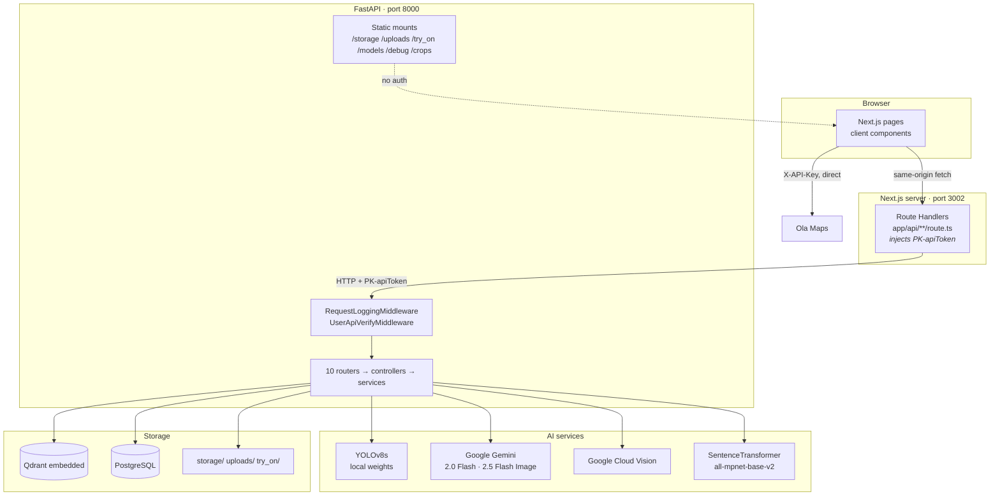

# System Overview

## What the system does

A user uploads a photograph. The backend detects whether it contains a person, extracts every clothing
item and accessory with a vision LLM, localises each item's bounding box, then matches the extracted
attributes against a product catalogue using vector similarity search. Separately, the user can select a
garment and have an image generated of themselves wearing it.

## Topology



## The BFF pattern

The browser never calls FastAPI directly. Each page calls a relative path such as `/api/search`, which
resolves to a Next.js Route Handler running server-side. That handler reads `API_TOKEN` from the server
environment, attaches it as `PK-apiToken`, and forwards to the backend.

Three consequences:

1. **The shared token never reaches the browser.** `API_TOKEN` deliberately has no `NEXT_PUBLIC_` prefix,
   so Next.js will not inline it into the client bundle.
2. **The backend needs no CORS configuration**, and has none. All browser traffic is same-origin.
3. **`NEXT_PUBLIC_API_URL` is only used server-side** despite its name.

Typical handler shape, consistent across all 37:

```ts
const backendRes = await fetch(`${API_URL}product/list`, {
  method: "POST",
  headers: { "Content-Type": "application/json", "PK-apiToken": API_TOKEN },
  body: JSON.stringify(body),
});
```

Note the direct concatenation — **`NEXT_PUBLIC_API_URL` must end with a trailing slash.** A few handlers
normalise with `API_URL.replace(/\/$/, "")` and tolerate either form.

**Two exceptions to the pattern.** `app/api/nearby-stores/route.ts` calls Ola Maps directly rather than
the backend, and `app/(auth)/uploade/page.tsx` loads the Google Maps JS SDK in the browser.

## Request lifecycle

```
Browser fetch("/api/...")
  │
  ├─ Next.js Route Handler — adds PK-apiToken
  │
  ▼  HTTP to FastAPI
RequestLoggingMiddleware
  │
UserApiVerifyMiddleware
  │   ├─ path starts with /storage, /debug, /try_on, /uploads, /models → PASS THROUGH, no token
  │   ├─ path in ["/", "/docs", "/redoc", "/openapi.json"]              → pass through
  │   ├─ no PK-apiToken            → Code 5001
  │   ├─ PK-apiToken != API_TOKEN  → Code 5002
  │   └─ sets request.state.country / timezone / dialing_code / base_url
  │
GlobalExceptionMiddleware
  │
APIRouter → Controller → Service → model / Qdrant / Gemini / Vision
  │
  ▼
success_response() | error_response()   →  always HTTP 200, {Success, Code, Error}
```

> The `/models` pass-through was written for the static mount but also matches the `/models` **router**,
> leaving 10 Phase 2 endpoints unauthenticated. See
> [../security/authentication-and-authorization.md](../security/authentication-and-authorization.md) and
> [AUDIT.md](../../AUDIT.md) issue 1.

## Technology inventory

| Concern | Choice | Where |
| ------- | ------ | ----- |
| Web framework | FastAPI | [`app/main.py`](../../backend/app/main.py) |
| ORM | SQLAlchemy 2.x `DeclarativeBase` | [`app/database/connection.py`](../../backend/app/database/connection.py) |
| Database | PostgreSQL via `psycopg2` | same |
| Person detection | **YOLOv8s** (`ultralytics`, `yolov8s.pt`) | [`app/services/detector.py`](../../backend/app/services/detector.py) |
| Attribute extraction | **Gemini 2.0 Flash** | [`app/services/vision_service.py`](../../backend/app/services/vision_service.py) |
| Object localization | **Google Cloud Vision** | same |
| Image generation | **Gemini 2.5 Flash Image** | [`app/services/photo_service.py`](../../backend/app/services/photo_service.py) |
| Embeddings | **SentenceTransformer `all-mpnet-base-v2`** (768-d) | [`app/vector/vector_db.py`](../../backend/app/vector/vector_db.py) |
| Vector store | **Qdrant** embedded | same |
| Image processing | OpenCV | detector / decision engine |
| Frontend | Next.js 16 App Router, React 19 | [`frontend/package.json`](../../frontend/package.json) |
| Styling | Tailwind CSS v4 | `postcss.config.mjs` |
| Maps | Ola Maps API, Google Maps JS | frontend only |

## What is deliberately absent

| Not present | Consequence |
| ----------- | ----------- |
| CLIP | The `backend/readme` claims it; embeddings are actually text-based SentenceTransformer |
| Celery / Redis / any broker | The readme claims background processing; none exists |
| CORS middleware | Correct for this topology |
| Database migrations | `create_all()` only; columns are never altered |
| User authentication | A single shared token guards the API |
| Automated tests, CI, Docker | None |

## Persistence split

State lives in three places:

- **PostgreSQL** — products, masters, stores, gallery, search history, Phase 2 model records.
- **Qdrant** (`VECTOR_DB_DIR`) — product embeddings for similarity search. **Recreated empty on every
  backend start** ([AUDIT.md](../../AUDIT.md) issue 3).
- **Filesystem** — uploaded search images (`storage/{admin_id}/`), analysis JSON (`storage/`), generated
  try-on images (`try_on/`), debug crops (`/tmp/person_crops`, `/tmp/debug_boxes`).

A database backup alone is not sufficient: it captures neither the vector index nor the images.
