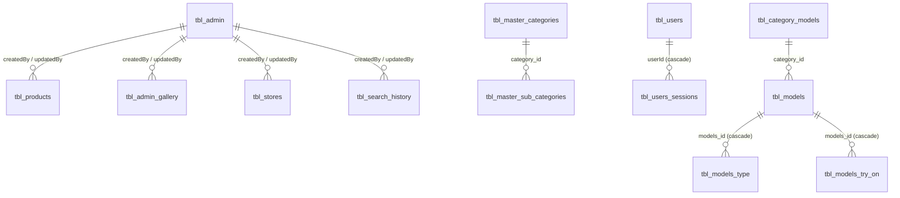

# Database Schema

PostgreSQL. **24 tables** defined as SQLAlchemy models in
[`backend/app/models/`](../../backend/app/models/) (21 model files, some declaring more than one table).

> **Source of truth.** This document is derived from the model definitions. The live database schema was
> **not inspected** — there is no dump, no migration history and no DDL in the repository. Because
> `create_all()` never alters existing tables, a long-lived database may have drifted.
> **The live schema is not verified from the current implementation.**

## Entity relationships

`tbl_products` links to masters **only by comma-separated string** — there are no foreign keys between
them. See [Known problems](#known-problems).

## Audit columns

Most tables carry: `createdBy`, `createdAt`, `updatedBy`, `updatedAt`, `deletedBy`, `deletedAt`, plus
read-only `createdAtFormatted` / `updatedAtFormatted` properties applying a hard-coded IST offset.
`createdBy` / `updatedBy` are `ForeignKey("tbl_admin.id")` on the catalogue tables and are populated with
a **hard-coded `1`** (`getattr(request.state, "adminUserId", 1)`), since no authentication supplies a
real user.

Phase 2 tables use a different convention: `createdAt` / `updatedAt` only, via `server_default=func.now()`.

---

## Catalogue

### `tbl_products`

| Column | Type | Notes |
| ------ | ---- | ----- |
| `id` | Integer PK, indexed | Also used as the **Qdrant point ID** |
| `hsn_code`, `product_code` | String(255) | |
| `name` | String(255) | |
| `mrp`, `price` | Float, default 1 | |
| `pattern_id`, `subtype_id`, `category_id`, `subcategory_id`, `brand_id`, `color_id`, `images` | **String(255)** | **Comma-separated ID lists — not foreign keys** |
| `gender` | String(255) | Lower-cased before indexing |
| `product_intro`, `description`, `specification` | String(1024) | All three feed the embedding text |
| `status` | Integer, default 1 | |

### `tbl_admin_gallery`

`imagePath` String(1024), `title`, `type`, `mimeType`, `fileSizeMB`, `status`. Exposes an `image_url`
property returning `BASE_URL + imagePath.lstrip("/")`. Products reference gallery rows by ID through the
comma-separated `images` column.

### `tbl_admin`

`name`, `mobile` (unique, indexed), `password`, `email` (NOT NULL), `role`, `status`.

> `admin_model.py` sets `IST = timezone(timedelta())` — **UTC**, not IST. Admin timestamps format
> differently from every other model.

---

## Masters

Six tables share an identical shape — `id`, `name` String(255), `description` String(500), `status`,
audit columns, and `created_by_user` / `updated_by_user` relationships to `AdminUsers`:

| Table | Extra |
| ----- | ----- |
| `tbl_master_categories` | `subcategories` relationship (back_populates) |
| `tbl_master_sub_categories` | `category_id` FK → `tbl_master_categories.id`; `category` relationship |
| `tbl_master_colors` | — |
| `tbl_master_brands` | — |
| `tbl_master_product_types` | — |
| `tbl_master_patterns` | **No route exposes it** — the frontend calls `master/pattern/list`, which does not exist |
| `tbl_master_subtypes` | **No route exposes it** — the frontend calls `master/subtype/list`, which does not exist |

[AUDIT.md](../../AUDIT.md) issue 10.

---

## Stores and search

### `tbl_stores`

`store_name` (NOT NULL), `address` String(500), `city`, `state`, `pincode`, `phone`, `email`,
**`latitude` / `longitude` Float**, `store_type` (NOT NULL), `website`, `products_id` String(255)
(comma-separated), `status`.

### `tbl_search_history`

| Column | Type | Notes |
| ------ | ---- | ----- |
| `imagePath` | String(1024) | Path under `storage/{admin_id}/` |
| `search_result` | **String(2048)** | ⚠️ **Too small** — enriched results routinely exceed it |
| `status` | Integer, default 1 | |

---

## Phase 2 — models and looks

| Table | Purpose | Key columns |
| ----- | ------- | ----------- |
| `tbl_models` | A fashion model / look | `model_name` (NOT NULL), **`modle_url`** (typo, Text NOT NULL), `prompt`, `category_id` FK → `tbl_category_models.id`, `gender`, `status` Boolean |
| `tbl_models_type` | Attributes of a model's outfit | `models_id` FK CASCADE, `category`, `type`, `subtype`, `color`, `pattern`, `brand`, `gender` |
| `tbl_models_try_on` | Try-on results per model | `models_id` FK CASCADE, `user_url` Text NOT NULL |
| `tbl_category_models` | Phase 2 categories | `name` (NOT NULL), `type`, `gallery_id` (NOT NULL, **no FK**), `description`, `gender` (NOT NULL) |
| `tbl_models_gallery` | Phase 2 images | `image_url` Text NOT NULL, `type` **Enum(`category`, `models`)**, column names lower-cased (`createdat`, `updatedat`) |
| `tbl_model_analysis` | Analysis records | `model_name`, `model_url` Text NOT NULL, `user_url`, `prompt` |

`tbl_models` declares `relationship("ModelTypeTable")` and `relationship("ModelTryOnTable")` with
`cascade="all, delete"`, plus `category = relationship("CategoryModelTable")`.

---

## User, session and profile tables — created but unused

These tables are created at startup and **no registered route reads or writes them**, because the
authentication and profile routers are commented out.

| Table | Key columns |
| ----- | ----------- |
| `tbl_users` | `userId` (unique, auto `U-XXXXXXXXXXXX`), `fullname`, `username`, `password`, `mobile` (unique, indexed), `dialingCode`, `email`, `companyName`, address fields, `latitude`/`longitude` (String), `gst`, `pan`; `sessions` relationship with `cascade="all, delete-orphan"` |
| `tbl_users_sessions` | `userId` FK → `tbl_users.userId`, `session_token`, `deviceId`, `sessionType` (default `WEB`) |
| `tbl_users_otps` | `dialingCode`, `mobile`, `email`, `platform`, `otpType`, `otp`, `failOtpAttempt` |
| `tbl_otps` | `dialingCode`, `mobile` (NOT NULL), `otp` (default `1111`) |
| `tbl_profiles` | `name`, `mobile` (unique, indexed, NOT NULL), `email`, `password`, `photo` |
| `tbl_user_profiles` | `imageUrl` |

Per project decision the disabled authentication subsystem is not documented as a feature; these tables
are listed only so their presence in the database is explained.

---

## Indexes and constraints

**Indexes:** `index=True` on primary keys, plus unique indexes on `tbl_admin.mobile`,
`tbl_users.mobile`, `tbl_users.userId` and `tbl_profiles.mobile`.

**No secondary indexes exist**, including on columns every query filters by:

| Unindexed column | Filtered by |
| ---------------- | ----------- |
| `tbl_master_sub_categories.category_id` | sub-category lookups |
| `tbl_models_type.models_id`, `tbl_models_try_on.models_id` | Phase 2 joins |
| `status` on every table | nearly every query |

At current volumes PostgreSQL will sequentially scan. The 300 ms slow-query logger in
[`connection.py`](../../backend/app/database/connection.py) will surface it when it matters.

**Constraints:** foreign keys as listed above; no check constraints; no unique constraint on product
code, master names or store name.

---

## Known problems

| # | Problem | Impact |
| - | ------- | ------ |
| 13 | `tbl_products` stores six ID lists as comma-separated `String(255)` | No referential integrity, unusable indexes, and **silent truncation at 255 characters** — a product with many brands, colours or images loses the overflow |
| 14 | `tbl_search_history.search_result` is `String(2048)` | Realistic enriched payloads exceed it; PostgreSQL rejects the insert with `StringDataRightTruncation` rather than truncating |
| 21 | `tbl_models.modle_url` is misspelled | Cosmetic, but renaming needs a migration that does not exist |
| 19 | No migrations | Model changes never reach an existing database |
| — | `tbl_category_models.gallery_id` has no foreign key | Dangling references possible |
| — | `tbl_documents`-style soft deletes are inconsistent | Catalogue uses `status`; Phase 2 uses Boolean `status` |

See [AUDIT.md](../../AUDIT.md) for full evidence.

## Migrations

None. See [../setup/database-setup.md](../setup/database-setup.md#migrations).
