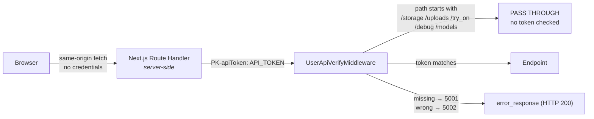

# Authentication and Authorization

## Summary

The entire access-control model is **one shared static token** — and it does not cover the whole API.

There are no users, no login, no sessions, no roles and no per-record authorization. Any client holding
`API_TOKEN` has complete read and write access. Ten endpoints require no credential at all.

## The implemented flow



[`app/middlewares/auth_middleware.py`](../../backend/app/middlewares/auth_middleware.py):

```python
if request.url.path.startswith("/storage"): return await call_next(request)
if request.url.path.startswith("/debug"):   return await call_next(request)
if request.url.path.startswith("/try_on"):  return await call_next(request)
if request.url.path.startswith("/uploads"): return await call_next(request)
if request.url.path.startswith("/models"):  return await call_next(request)
if request.url.path in ["/", "/docs", "/redoc", "/openapi.json"]:
    return await call_next(request)

api_token = request.headers.get("PK-apiToken")
if not api_token:                   return error_response("API Token required", code=5001)
if api_token != env('API_TOKEN'):   return error_response("Invalid API Token", code=5002)
```

That comparison is the whole of authentication. No user lookup, no expiry, no revocation, no rotation.

---

## 🔴 The `/models` bypass

The `startswith("/models")` skip exists so the `/models` **static mount** can serve files. But
[`app/routes/models_routes.py:14`](../../backend/app/routes/models_routes.py) declares
`prefix="/models"` — the same path. The check runs before routing, so it matches both.

**All 10 Phase 2 endpoints are callable with no `PK-apiToken`:**

```
POST /models/user-photo          POST /models/category_create
GET  /models/last-user-photo     POST /models/category-list
POST /models/upload-gallery      POST /models/save-models
POST /models/gallery-list        POST /models/user-try-on
POST /models/gallery-delete      POST /models/models-list
```

This includes endpoints that accept file uploads, write to the database and invoke paid Gemini calls.

**Fix direction:** rename the static mount (e.g. `/model-assets`) and delete the `/models` skip, or
replace the prefix test with an exact static-path match. No code change has been made — this is
documented only. [AUDIT.md](../../AUDIT.md) issue 1.

---

## What is done well

**The token never reaches the browser.** `API_TOKEN` deliberately has no `NEXT_PUBLIC_` prefix, so
Next.js excludes it from the client bundle. It is read only inside server-side route handlers. A user
inspecting network traffic sees same-origin calls with no credentials.

**No CORS surface.** Because the browser only calls same-origin route handlers, FastAPI needs no CORS
configuration, and cross-origin browser access is not possible by default.

**Try-on validates its inputs.** Path traversal is blocked with `normpath` plus a prefix check, content
type is verified, and two Gemini safety gates run before generation.

---

## What is missing

| Capability | Status |
| ---------- | ------ |
| User accounts | ❌ Tables exist (`tbl_users`, `tbl_profiles`); no route touches them |
| Login / logout / registration | ❌ Every route in `login_routes.py` is commented out; `profile_routes` is commented out in `main.py` |
| Sessions / JWT | ❌ `UserSessionVerifyMiddleware` and `verify_session` exist but are never registered |
| Roles | ❌ `PK-role` is accepted, forwarded and **never read** |
| Permissions | ❌ None |
| Per-record ownership | ❌ `createdBy`/`updatedBy` hard-coded to `1` |
| Token expiry / rotation | ❌ Static value in `.env` |
| Rate limiting | ❌ None |
| Audit trail | ❌ `logs/requests.log` records requests but no actor |

### Unreachable error codes

`5003` (invalid session), `5004` (token mismatch), `5010` (account blocked), `5011` (device blocked) and
`4010` (invalid/expired JWT) are defined in the disabled session and JWT machinery and **can never be
returned**. See [../api/error-codes.md](../api/error-codes.md).

---

## Static file exposure

Five path prefixes bypass the token check. Four of them serve real user data:

| Mount | Serves | Sensitivity |
| ----- | ------ | ----------- |
| `/storage` | Uploaded search photographs (`storage/{admin_id}/*.jpg`) | **User-submitted images** |
| `/uploads` | Gallery uploads | Product imagery |
| `/try_on` | Generated try-on images | **User's face composited with garments** |
| `/debug` | Annotated crops from `/tmp/debug_boxes` | **Cropped person images** |
| `/crops` | `/tmp/person_crops` | **Cropped person images** — note this prefix is *not* in the skip list, so it is token-protected while `/debug` is not |

Paths are guessable (`/storage/1/product_search_20260115_074544.jpg`). Try-on filenames are UUID4, which
is the only meaningful protection anywhere in this set.

[AUDIT.md](../../AUDIT.md) issue 9.

---

## Concrete implications

Anyone with the token can read and modify the entire catalogue, upload images, run paid Gemini analyses
and generate try-on images. Anyone **without** the token can still call all 10 Phase 2 endpoints and
download every uploaded photograph, generated image and debug crop.

Two further exposures:

- **The database password is printed to stdout** at import (`connection.py:32`).
- **`logs/slow_queries.log` records bound parameters** for any statement over 300 ms.

---

## Deployment guidance

Treat this application as **an internal tool with no access control of its own**. Do not expose it to
the internet as-is.

If it must be reachable beyond localhost, put protection outside the application:

1. **Network isolation** — VPN or private subnet; never a public IP.
2. **An authenticating reverse proxy** — OAuth2 proxy, SSO forward-auth, or at minimum HTTP basic auth
   in front of both ports.
3. **Do not expose port 8000 at all.** Only the Next.js port needs to be reachable.
4. **Block or authenticate `/storage`, `/uploads`, `/try_on`, `/debug` and `/models` at the proxy** until
   the middleware is corrected.
5. **Treat `API_TOKEN` as a high-value secret** — long, random, per-environment, rotated by editing both
   `.env` files and restarting.
6. **Protect `logs/` and the image directories** with the same care as production credentials.
7. **Keep `vision-key.json` out of version control** — now enforced by `.gitignore`; see
   [../setup/google-cloud-credentials.md](../setup/google-cloud-credentials.md).

## If authentication is added later

The commented-out scaffolding is not a usable starting point — `verify_session` depends on
`session_service`, `admin_routes` imports two schema modules that do not exist, and no frontend login
page exists. A real implementation needs: working session or JWT issuance; the session middleware
actually registered; ownership columns enforced in queries rather than merely present; a frontend login
page and route guard; and `request.state.userId` replacing the hard-coded `admin_id = 1`.

Until then, document and operate the system as unauthenticated.
